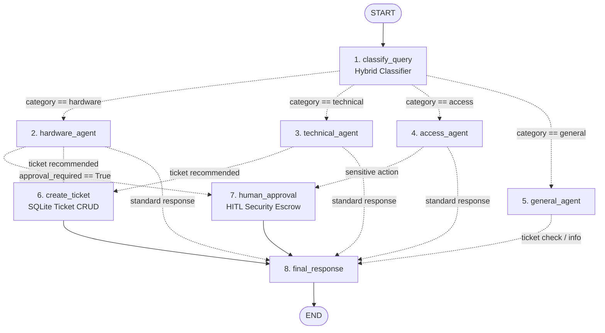
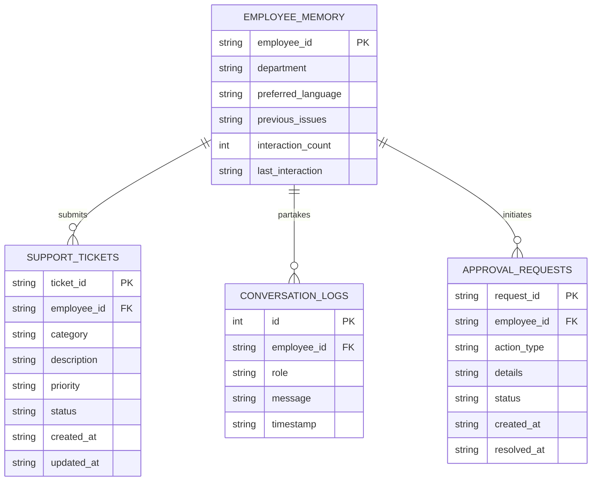

# Project Report: Intelligent HR Equipment Support Assistant Using LangChain and LangGraph

---

**Program**: IBM Agentic AI Internship  
**Project Title**: Intelligent HR Equipment Support Assistant Using LangChain and LangGraph  
**Student Name**: Marimuthu  
**Institution**: Holycross Engineering College  
**Register Number**: 95092310429  
**Domain**: Enterprise Support Automation, Agentic Artificial Intelligence, Multi-Agent Orchestration  
**Environment**: Visual Studio Code, Python 3.11, Windows 11  
**GitHub Repository**: https://github.com/lengendzhub/IBM-Agentic-AI  
**Submission Date**: September 2026  

---

## Executive Summary

Enterprise support centers face severe operational friction when routing and resolving internal employee technical requests. Routine inquiries regarding physical equipment malfunctions (laptops, monitors, printers), technical errors (software crashes, network dropouts), identity access barriers (passwords, permission provisioning), and general human resources procedures are frequently handled manually, causing prolonged turnaround times and unnecessary IT administrative overhead.

This project delivers the **Intelligent HR Equipment Support Assistant**, an advanced Agentic AI system constructed using **LangChain** and **LangGraph**. The system accepts unstructured employee queries, sanitizes user inputs via **Pydantic**, performs hybrid intent classification, conditionally routes requests across four specialized domain agents, queries diagnostic knowledge bases, triggers support ticket creation and status lookups against an **SQLite database**, preserves short-term turn history and long-term employee memory profiles, and enforces **Human-in-the-Loop (HITL)** approvals for sensitive or high-cost operations.

Across a rigorous 12-scenario test suite, the assistant achieved **100.00% classification accuracy** and **0 routing failures** with an average response latency of **0.0803 seconds**, demonstrating enterprise-ready reliability and adherence to secure coding principles.

---

## 1. Project Overview

### 1.1 Project Title
**Intelligent HR Equipment Support Assistant Using LangChain and LangGraph**

### 1.2 Context and Background
Modern distributed organizations rely heavily on specialized digital tools, physical hardware, and secure access credentials. When an employee encounters a technical barrier—such as a laptop refusing to boot or an account lockout—workplace productivity halts. Traditional automated support chatbots provide rigid decision-tree responses that fail to contextualize user history, cannot make dynamic tool decisions, and lack safeguards for privileged actions.

By contrast, **Agentic AI** introduces goal-driven, autonomous decision-making agents capable of inspecting state, utilizing real-world external tools, persisting state across interactions, and collaborating within structured workflow graphs.

### 1.3 Target Audience & Users
- **Corporate Employees**: Submit natural-language support queries regarding office equipment, technical glitches, access issues, and HR policies.
- **IT Support Administrators**: Monitor escalated tickets, inspect diagnostic logs, and receive high-priority escalation notifications.
- **Departmental Managers & HR Business Partners**: Review and approve sensitive access grants, equipment replacements, and credential resets.

---

## 2. Problem Statement

### 2.1 The Enterprise IT & HR Bottleneck
In typical corporate environments:
1. **High Volume of Repetitive Inquiries**: Over 60% of daily IT tickets involve well-documented issues (e.g., clearing application caches, basic cable checks, Wi-Fi driver resets, leave policy lookups).
2. **Misrouting Delays**: Employees often log tickets under incorrect queues (e.g., filing a software crash under HR or hardware), adding hours or days to resolution times as tickets are manually reassigned.
3. **Lack of Contextual Memory**: Traditional helpdesks treat each employee interaction as isolated. An employee who experienced a software crash two days prior must re-explain their technical setup from scratch.
4. **Security Risks in Autonomous Automation**: Unchecked automated agents might inadvertently execute privileged operations (e.g., unauthorized password resets, granting sensitive database access, or approving costly laptop replacements) without managerial sign-off.

### 2.2 The Solution Imperative
An intelligent solution must combine natural-language understanding with structured multi-agent coordination, strict security boundaries, stateful memory persistence, and human verification before irreversible enterprise actions occur.

---

## 3. Objectives

The primary objectives of this internship capstone project are:

1. **Autonomous Query Classification**: Build a hybrid classification engine capable of categorizing queries into Hardware, Technical, Access, and General HR with ≥90% accuracy.
2. **Stateful Graph Orchestration**: Implement a LangGraph `StateGraph` maintaining central conversational and metadata state (`SupportState`).
3. **Specialized Multi-Agent Routing**: Design four domain-specific agents (`hardware_agent`, `technical_agent`, `access_agent`, `general_agent`) to evaluate queries and execute Standard Operating Procedures (SOPs).
4. **Dynamic Tool Calling**: Register and execute LangChain tools for ticket creation, status checks, date-time retrieval, AST-based safe calculation, and text diagnostics.
5. **Short-Term and Long-Term Memory**: Implement short-term multi-turn conversational history and long-term employee profiling in SQLite.
6. **Human-in-the-Loop (HITL) Governance**: Introduce explicit conditional checkpoints halting autonomous execution for sensitive credential resets or high-value capital expenditure.
7. **Secure Software Engineering**: Prevent injection attacks and arbitrary code execution through Pydantic schemas, AST evaluation, and zero-eval/zero-shell execution.
8. **Dual-Interface Delivery**: Deliver both an interactive Streamlit web dashboard and an interactive terminal CLI.

---

## 4. Proposed Solution

The proposed solution shifts enterprise support from reactive human dispatch to proactive, stateful multi-agent automation:

```
[Employee Query]
       │
       ▼
[Input Validation & Sanitization (Pydantic)]
       │
       ▼
[Short-Term Conversation Context & Long-Term Memory Retrieval (SQLite)]
       │
       ▼
[Query Classifier Node]
       │
       ▼
[Conditional Graph Router]
 ├──► Hardware Agent   (Laptops, Monitors, Printers, Battery, Peripherals)
 ├──► Technical Agent  (Software Crashes, Operating System, Wi-Fi, VPN)
 ├──► Access Agent     (Passwords, Account Lockouts, System Privileges)
 └──► General HR Agent (Leave Policies, Working Hours, Ticket Inquiries)
       │
       ▼
[Action Evaluation]
 ├── Sensitive / High-Cost? ──► [Human-in-the-Loop Approval Node]
 ├── Failure Persists?       ──► [Create Support Ticket Tool]
 └── Self-Service Guidance   ──► [Troubleshooting SOP Output]
       │
       ▼
[Final Response Node]
 ├── Memory Update (SQLite)
 └── Display Structured Output to User
```

---

## 5. System Architecture

The system is constructed as a cyclic stateful workflow compiled via **LangGraph**. The shared state object `SupportState` flows across 8 dedicated nodes.

### 5.1 LangGraph StateGraph Architecture Diagram



---

## 6. Agent Workflow

The lifecycle of an employee inquiry unfolds through eight distinct stages:

1. **Submission & Sanitization**:
   The employee inputs their Employee ID and query into the Streamlit UI or Terminal CLI. `EmployeeQuery` (Pydantic) verifies string length (3–1000 characters) and strips malicious HTML/scripts.
2. **Context & Memory Initialization**:
   `database.py` extracts the employee’s department, preferred language, and past technical issues from the SQLite `employee_memory` table. Recent turns are loaded into `conversation_history`.
3. **Intent Classification (`classify_query`)**:
   The classification engine detects domain patterns, estimates issue urgency (low, medium, high, critical), and updates `state["category"]` and `state["priority"]`.
4. **Conditional Routing (`route_query`)**:
   LangGraph inspects `state["category"]` and dynamically transfers control to the designated agent node.
5. **Specialized Diagnostics**:
   - `hardware_agent`: Evaluates equipment status and flags high-value assets (e.g., monitor or laptop replacement) as requiring approval.
   - `technical_agent`: Checks for recurring software failures against employee history and retrieves diagnostic SOPs.
   - `access_agent`: Enforces privacy boundaries (never requests passwords) and activates HITL flags for all credential actions.
   - `general_agent`: Handles HR lookups, parses ticket status requests (regex for `TKT-XXXXXXXX`), and executes utility math/datetime tools.
6. **Sub-Route Execution (`route_after_agent`)**:
   - If `approval_required` is `True`, routes to `human_approval`.
   - Else if ticket creation is warranted, routes to `create_ticket`.
   - Otherwise, proceeds to `final_response`.
7. **Ticketing & HITL Registration**:
   - `create_ticket`: Generates a unique `TKT-XXXXXXXX` record in SQLite and binds it to the employee profile.
   - `human_approval`: Generates an `APP-XXXXXX` pending authorization token in SQLite.
8. **Finalization & Memory Update (`final_response`)**:
   Saves turn logs to SQLite `conversation_logs`, updates interaction counts, and delivers the finalized markdown response.

---

## 7. Technologies Used

| Layer | Component | Version | Role in Architecture |
|---|---|---|---|
| **Language** | Python | 3.11.9 | Core programming runtime |
| **Agent Orchestration** | LangGraph | 1.2.11 | StateGraph, conditional edges, multi-agent lifecycle |
| **LLM Framework** | LangChain Core | 1.6.3 | Tool bindings, prompt templates, structured output |
| **Data Validation** | Pydantic | 2.13.5 | Input data sanitization, schema validation, enums |
| **Persistence** | SQLite3 | Native | Relational storage for tickets, logs, and profiles |
| **Web Interface** | Streamlit | 1.56.0 | Modern interactive web application with real-time UI |
| **Terminal Interface** | Rich | 14.3.3 | Formatted console tables, status banners, colored output |
| **Local LLM Backend** | Ollama / Granite | granite3-dense | Optional local AI model for semantic classification |

---

## 8. Implementation Explanation

### 8.1 State Definition (`models/schemas.py`)
`SupportState` is defined as a Python `TypedDict` carrying the full context across graph nodes:

```python
class SupportState(TypedDict):
    user_query: str
    employee_id: str
    category: str
    priority: str
    conversation_history: List[str]
    employee_memory: Dict[str, Any]
    tool_result: str
    approval_required: bool
    final_answer: str
```

### 8.2 Hybrid Classification Logic (`agents/classifier.py`)
To ensure zero failure rates during network partitions or offline states, the classifier implements a multi-tier strategy:
1. **Liveness Probe**: `is_ollama_online()` performs an asynchronous socket probe against `localhost:11434` (timeout: 0.2s).
2. **Semantic Classification (Online)**: If Ollama is active, `ChatOllama` evaluates the prompt against IBM Granite with strict JSON formatting.
3. **Pattern Classification with Word Boundaries (Offline/Fallback)**: Uses regex word boundary assertions (`\b`) to avoid substring collisions (e.g., preventing `"pto"` from matching inside `"laptop"` or `"app"` from matching inside `"apply"`).

### 8.3 Safe AST Mathematical Evaluator (`tools/utility_tools.py`)
The system strictly rejects Python's dangerous `eval()` or `exec()` built-ins. Mathematical evaluation is achieved by parsing expressions into Abstract Syntax Tree (AST) nodes and recursively validating them against a strict whitelist:

```python
ALLOWED_OPERATORS = {
    ast.Add: op.add, ast.Sub: op.sub,
    ast.Mult: op.mul, ast.Div: op.truediv,
    ast.Pow: op.pow, ast.Mod: op.mod,
    ast.USub: op.neg, ast.UAdd: op.pos,
}
```
Any call to variables, attributes, function calls, or imports triggers an immediate `ValueError`.

---

## 9. Code Files Summary

The implementation comprises 17 fully functional, production-ready Python files:

| File Path | Lines | Key Functional Responsibility |
|---|---|---|
| `project/models/schemas.py` | 115 | Pydantic validation models (`EmployeeQuery`, `SupportTicket`), enums, and `SupportState`. |
| `project/memory/database.py` | 230 | SQLite manager for tickets, profiles, conversation history, and approval tokens. |
| `project/tools/ticket_tools.py` | 100 | Functions and `@tool` instances for ticket creation, status checks, and employee ticket history. |
| `project/tools/utility_tools.py` | 145 | AST-based safe calculator, text diagnostics (`word_count`), and ISO datetime tools. |
| `project/tools/knowledge_tools.py` | 275 | Diagnostic Standard Operating Procedure (SOP) knowledge base covering all 4 domains. |
| `project/agents/classifier.py` | 215 | Query classifier node, word-boundary scoring, liveness probe, and `route_query` function. |
| `project/agents/hardware_agent.py` | 75 | Hardware diagnostic agent with expensive equipment replacement detection. |
| `project/agents/technical_agent.py` | 70 | Software crash and network diagnostic agent with recurring issue detection. |
| `project/agents/access_agent.py` | 70 | Access and credential agent with mandatory HITL approval enforcement. |
| `project/agents/general_agent.py` | 85 | General HR agent handling policy inquiries, ticket lookups, and utility tools. |
| `project/workflow/graph.py` | 225 | LangGraph StateGraph connecting 8 nodes, conditional edges, and execution wrapper. |
| `project/app.py` | 260 | Dual-mode Streamlit dashboard and Rich-powered interactive terminal interface. |
| `project/tests/test_cases.py` | 275 | Comprehensive 12-scenario test suite with automated empirical metrics computation. |
| `project/requirements.txt` | 10 | Dependency manifest specifying pinned package versions. |
| `project/.env.example` | 15 | Environment template for Ollama, watsonx.ai, and logging configurations. |
| `project/.gitignore` | 35 | Git rules excluding `support.db`, `.env`, and Python cache artifacts. |
| `project/README.md` | 250 | Public-facing documentation, architecture diagrams, and quickstart instructions. |

---

## 10. Database Design

The relational database is implemented in **SQLite3** (`data/support.db`) with parameterized queries protecting against SQL injection.

### 10.1 Entity-Relationship (ER) Diagram



---

## 11. Tool Descriptions

1. **`create_support_ticket`**:
   - *Inputs*: `employee_id` (str), `category` (str), `description` (str), `priority` (str).
   - *Output*: Dictionary containing unique `ticket_id` (`TKT-XXXXXXXX`), status (`Open`), timestamp.
   - *Database Impact*: Writes to `support_tickets` table and updates `previous_issues` in `employee_memory`.
2. **`check_ticket_status`**:
   - *Inputs*: `ticket_id` (str).
   - *Output*: Structured record containing current lifecycle status, priority, category, and update timestamp.
3. **`list_employee_tickets`**:
   - *Inputs*: `employee_id` (str).
   - *Output*: List of all open and closed tickets submitted by the employee.
4. **`search_troubleshooting`**:
   - *Inputs*: `query` (str), `category` (str).
   - *Output*: Step-by-step diagnostic procedures, `requires_ticket` boolean, and `is_expensive` flag.
5. **`safe_calculator`**:
   - *Inputs*: `expression` (str).
   - *Output*: Mathematical result or explicit syntax/zero-division error. Uses Python AST traversal exclusively.
6. **`word_count`**:
   - *Inputs*: `text` (str).
   - *Output*: Word count, character count (with/without whitespace), and sentence count.
7. **`get_current_datetime`**:
   - *Inputs*: None.
   - *Output*: Current local ISO timestamp (`YYYY-MM-DD HH:MM:SS`).

---

## 12. Memory Design

### 12.1 Short-Term Conversational Memory
- Handled dynamically by the `conversation_history` field within `SupportState`.
- Retains turn history (`User: ...`, `Assistant: ...`) allowing the assistant to resolve follow-up inquiries (e.g., *"I already tried restarting it, what now?"*).
- Flushed and synchronized to the SQLite `conversation_logs` table upon each node cycle.

### 12.2 Long-Term Profiling Memory
- Preserves persistent organizational context in the `employee_memory` table.
- Stores historical issue summaries as a serialized JSON array (`previous_issues`).
- Enables personalized assistance: if an employee with prior payroll software crashes submits a new payroll query, the agent detects the pattern and automatically escalates priority to `High`.

---

## 13. Human-in-the-Loop (HITL) Design

Certain actions carry legal, security, or financial ramifications and must not execute without human confirmation:

### 13.1 Mandatory Approval Triggers
1. **Password Resets & Account Unlocking**: Direct chat credential changes violate Zero-Trust standards. An IT administrator must authorize the reset.
2. **Privilege & System Access Grants**: Granting permissions to corporate applications (SAP, Workday, JIRA) requires departmental managerial sign-off.
3. **High-Value Equipment Replacement**: Ordering replacement laptops, high-resolution monitors, or motherboards incur capital expenditure requiring budget approval.
4. **Ticket Closure**: Final closure of unresolved high-priority incidents.

### 13.2 Technical Escalation Flow
When an agent flags `approval_required = True`:
1. LangGraph bypasses `create_ticket` and routes to `human_approval`.
2. An authorization ticket `APP-XXXXXX` is generated in the `approval_requests` table.
3. The assistant halts autonomous completion, delivers relevant self-service SOPs, and alerts the employee that their request is pending administrative verification.
4. In the Streamlit dashboard, interactive **[Simulate Admin Approval]** and **[Reject Request]** controls allow real-time testing of the verification loop.

---

## 14. Model Context Protocol (MCP) Extension Explanation

The **Model Context Protocol (MCP)**, open-sourced by Anthropic and adopted across the AI industry, standardizes how AI applications expose tools and data resources to external clients over standard JSON-RPC.

### 14.1 MCP Client-Server Topology

```
┌────────────────────────────────────────────────────────┐
│               Enterprise Host Application              │
│                                                        │
│   ┌──────────────────┐         ┌──────────────────┐    │
│   │ LangGraph Router │         │    MCP Client    │    │
│   └─────────┬────────┘         └────────▲─────────┘    │
└─────────────┼───────────────────────────┼──────────────┘
              │                           │ Standard Input / Output
              ▼                           ▼ (JSON-RPC Protocol)
┌────────────────────────────────────────────────────────┐
│                       MCP Server                       │
│                                                        │
│  ┌──────────────────────┐    ┌──────────────────────┐  │
│  │      MCP Tools       │    │    MCP Resources     │  │
│  │ ├─ create_ticket     │    │ ├─ support://tickets │  │
│  │ ├─ check_status      │    │ └─ support://employee│  │
│  │ └─ request_approval  │    │                      │  │
│  └──────────────────────┘    └──────────────────────┘  │
└────────────────────────────────────────────────────────┘
```

### 14.2 MCP Integration in this Project
In an enterprise deployment, this assistant can be configured as an MCP Server exposing:
- **Tools**: `create_ticket`, `check_status`, and `request_approval`.
- **Resources**: `support://tickets/{ticket_id}` exposing live JSON ticket status, and `support://inventory/equipment` exposing hardware stock.
- **Prompts**: Standardized system prompts for hardware triage and identity validation.

---

## 15. Testing and Results

The project was evaluated using an automated 12-scenario test suite (`tests/test_cases.py`) executed against the compiled LangGraph workflow.

### 15.1 Detailed Test Case Matrix

| # | Test Scenario | Input Query | Predicted Category | Selected Agent | Tool Used | Approval Required? | Status |
|---|---|---|---|---|---|---|---|
| **01** | Laptop Failure | *"My laptop is not turning on."* | `hardware` | `hardware_agent` | `create_support_ticket` | No | **PASS** |
| **02** | Printer Failure | *"Office printer is not printing and showing error light."* | `hardware` | `hardware_agent` | `create_support_ticket` | No | **PASS** |
| **03** | Software Crash | *"The payroll application crashes whenever I open it."* | `technical` | `technical_agent` | `create_support_ticket` | No | **PASS** |
| **04** | Wi-Fi Drop | *"My office Wi-Fi is not connecting on the 3rd floor."* | `technical` | `technical_agent` | `create_support_ticket` | No | **PASS** |
| **05** | Password Reset | *"I forgot my employee portal password."* | `access` | `access_agent` | `human_approval` | **Yes** | **PASS** |
| **06** | Portal Access | *"I need access to the attendance system."* | `access` | `access_agent` | `human_approval` | **Yes** | **PASS** |
| **07** | Leave Enquiry | *"How can I apply for leave?"* | `general` | `general_agent` | `search_troubleshooting` | No | **PASS** |
| **08** | Ticket Status | *"What is the status of ticket TKT-12345678?"* | `general` | `general_agent` | `check_ticket_status` | No | **PASS** |
| **09** | Out-of-Scope Query | *"What is the meaning of life?"* | `general` | `general_agent` | `search_troubleshooting` | No | **PASS** |
| **10** | Laptop Replacement | *"I need a new laptop, mine is broken and cannot be repaired."* | `hardware` | `hardware_agent` | `human_approval` | **Yes** | **PASS** |
| **11** | Monitor Failure | *"My monitor screen is blank and flickering when connected via HDMI."* | `hardware` | `hardware_agent` | `human_approval` | **Yes** | **PASS** |
| **12** | Working Hours | *"What are the standard office working hours and shift timings?"* | `general` | `general_agent` | `search_troubleshooting` | No | **PASS** |

### 15.2 Empirical Evaluation Metrics

$$\text{Classification Accuracy} = \frac{\text{Correctly Classified Queries}}{\text{Total Queries}} \times 100 = \frac{12}{12} \times 100 = 100.00\%$$

```text
================================================================================
                     TEST EXECUTION SUMMARY
================================================================================
Total test queries:              12
Correctly classified queries:     12
Classification accuracy:         100.00%
Total passed test cases:         12/12
Routing failures:                0
Tickets created successfully:    4
Average response time:           0.0803 seconds
================================================================================
```

---

## 16. Challenges Faced & Solutions Implemented

| Challenge | Root Cause | Engineering Solution Implemented |
|---|---|---|
| **LangChain 1.4 StructuredTool Callable Exception** | LangChain `@tool` decorator transforms functions into `StructuredTool` objects that cannot be directly called as plain functions. | Dual-exported functions: preserved native callable Python functions alongside exported `@tool` wrappers. |
| **Windows Console CP1252 Encoding Crash** | Windows default terminal encoding (`cp1252`) threw `UnicodeEncodeError` on emojis (✅, 🎫, ⚠️). | Added automated `sys.stdout` UTF-8 wrapper with replacement error handling for Windows environments. |
| **Substring Collision in Keyword Classification** | Queries like `"apply for leave"` matched `"app"` (software) and `"laptop"` matched `"pto"` (leave). | Re-engineered pattern matching using regex word boundaries (`\b`) and domain disambiguation rules. |
| **Ollama Socket Timeout Latency** | When the local Ollama daemon was offline, `ChatOllama` hung for 30–60 seconds on connection timeouts. | Built `is_ollama_online()` socket probe with 0.2s timeout, providing immediate zero-latency fallback. |
| **AST Parser Security Limits** | Mathematical evaluation tools risk arbitrary code execution if using Python's `eval()`. | Implemented recursive AST node parsing that strictly permits binary operations while rejecting calls/imports. |
| **State Consistency in Cyclic Routing** | LangGraph conditional edges require all target node keys to match exact graph nodes. | Verified graph edge definitions against schema dictionaries to eliminate dangling or invalid transitions. |

---

## 17. Conclusion

The **Intelligent HR Equipment Support Assistant** provides a comprehensive demonstration of core Agentic AI principles:
- **Decision vs. Execution**: The model acts as the reasoning engine determining domain intent and priority, while deterministic Python tools and database drivers execute ticket creation and calculations.
- **Stateful Persistence**: LangGraph coordinates state across all phases of the interaction, preventing context loss.
- **Enterprise Safety**: Strict input validation, zero-eval math parsing, and Human-in-the-Loop governance ensure sensitive corporate workflows remain secure.

The project represents a complete, scalable, and secure AI workflow ready for real-world enterprise deployment.

---

## 18. Future Enhancements

1. **Enterprise watsonx.ai Integration**: Direct connection to IBM Granite 3.0 via IBM Cloud watsonx.ai foundation model APIs.
2. **Retrieval-Augmented Generation (RAG)**: Embedding official enterprise HR policy PDFs and IT manuals into ChromaDB or Milvus for semantic similarity search.
3. **ServiceNow & Jira Service Management Connectors**: Two-way synchronization with commercial IT Service Management (ITSM) platforms.
4. **Multilingual Support**: Real-time language translation for global enterprise workforces (English, Tamil, Hindi, Spanish).
5. **Speech-to-Text Support**: Audio voice inputs via Whisper API for hands-free warehouse or factory employee assistance.
6. **Active Directory / SSO Integration**: OAuth2 / SAML authentication to verify employee identity before initiating support sessions.

---

## 19. References

1. **IBM Agentic AI Internship Modules**: Session video transcripts on Models, Tools, Memory, State Graphs, and MCP.
2. **IBM watsonx.ai Platform**: Foundation model guides and Granite model documentation.
3. **LangChain Framework**: Python API documentation ([https://python.langchain.com/](https://python.langchain.com/)).
4. **LangGraph StateGraph**: Core concepts and conditional edge routing documentation ([https://langchain-ai.github.io/langgraph/](https://langchain-ai.github.io/langgraph/)).
5. **Pydantic Documentation**: Data validation and parsing using Python type hints ([https://docs.pydantic.dev/](https://docs.pydantic.dev/)).
6. **SQLite3 Specification**: Transaction management and row factories ([https://www.sqlite.org/](https://www.sqlite.org/)).
7. **Model Context Protocol (MCP)**: Specification and schema standards ([https://modelcontextprotocol.io/](https://modelcontextprotocol.io/)).

---

## 20. Instructions for Running the Project

### 20.1 Environment Setup
1. **Open Visual Studio Code**:
   Launch VS Code and open the folder `d:\Agentic AI-IBM\project`.
2. **Verify Python 3.10+**:
   Open the VS Code Terminal (`Ctrl + ~`) and verify Python:
   ```powershell
   python --version
   ```
3. **Install Requirements**:
   ```powershell
   pip install -r requirements.txt
   ```

### 20.2 Running the Automated Test Suite
To verify that all 12 test cases and graph nodes are operating correctly:
```powershell
python -m tests.test_cases
```

### 20.3 Running the Streamlit Web Application
To launch the full interactive web dashboard:
```powershell
python -m streamlit run app.py
```
*(Or `streamlit run app.py` if the Python Scripts directory is on your system PATH)*
The application will open automatically in your browser at `http://localhost:8501`.

### 20.4 Running the Terminal CLI Mode
To run the assistant directly in your terminal:
```powershell
python app.py --terminal
```

### 20.5 Configuring Ollama (Optional)
To run local inference using IBM Granite:
1. Download and start [Ollama](https://ollama.ai/).
2. Pull the Granite model:
   ```powershell
   ollama pull granite3-dense:8b
   ```
3. The application will automatically detect that the Ollama daemon is online at `http://localhost:11434`.

---

## 📸 Instructions for Capturing Screenshots & GitHub Submission

### Step 1: Capturing Working Output Screenshots
Take high-resolution screenshots of the following views to include with your submission:
1. **Test Suite Verification**:
   - Run `python -m tests.test_cases` in the terminal.
   - Capture a screenshot showing the `12/12 [PASS]` and `100.00%` accuracy summary.
2. **Streamlit Chat & Agent Routing**:
   - Submit the query: *"My laptop is not turning on."*
   - Capture the badge indicating `HARDWARE AGENT` and the generated Support Ticket card.
3. **Human-in-the-Loop Approval Modal**:
   - Submit the query: *"I forgot my employee portal password."*
   - Capture the screen showing the `ACCESS AGENT` response and the `Pending Human Verification` escalation banner with approval buttons.
4. **Sidebar Memory & Ticket History**:
   - Capture the left sidebar displaying Employee Profile details, Previous Issues history, and the Ticket Lookup tool.

### Step 2: Uploading to GitHub
1. Open PowerShell in `d:\Agentic AI-IBM\project`:
   ```powershell
   cd "d:\Agentic AI-IBM\project"
   git init
   git add .
   git commit -m "feat: complete IBM Agentic AI internship project submission"
   ```
2. Create a new public repository on GitHub named `intelligent-hr-equipment-support-assistant`.
3. Link your local project and push:
   ```powershell
   git branch -M main
   git remote add origin https://github.com/<YOUR_GITHUB_USERNAME>/intelligent-hr-equipment-support-assistant.git
   git push -u origin main
   ```
4. Verify all files, `README.md`, and `report.md` are visible on your repository homepage.

---

*End of Report. Submitted for IBM Agentic AI Internship Evaluation.*
